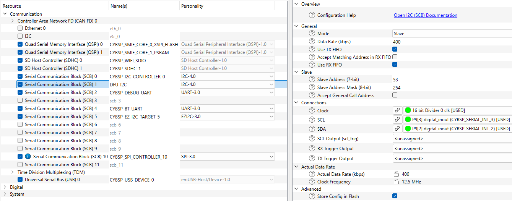
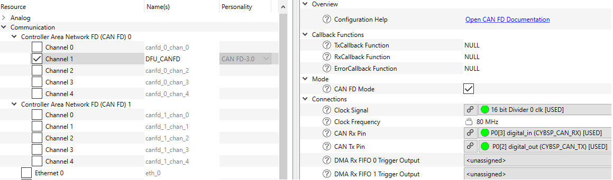
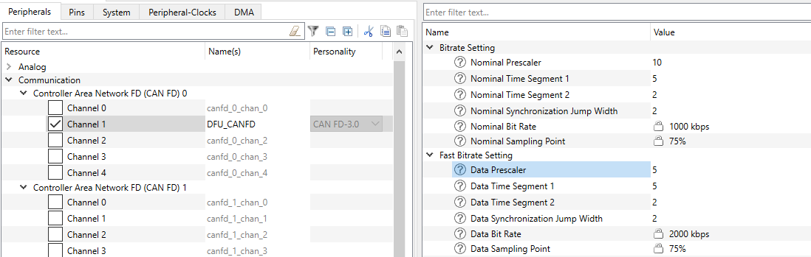
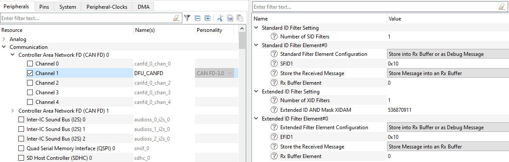
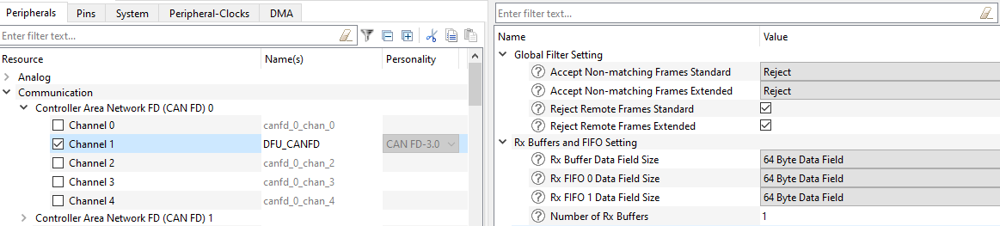
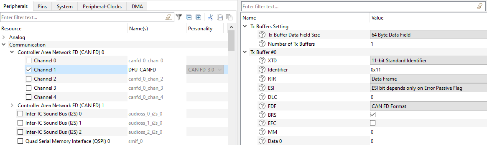
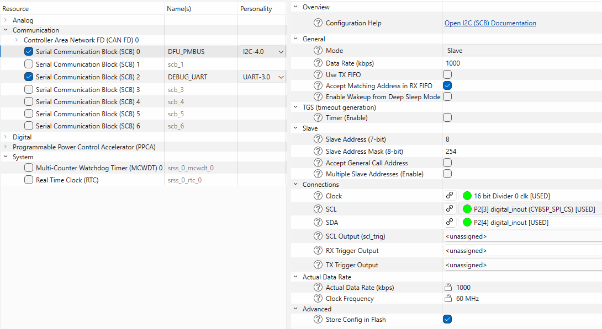
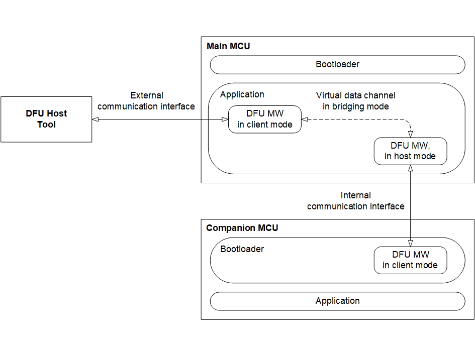

# Device Firmware Update (DFU) Middleware Library

## Overview

The DFU middleware library provides an SDK to receive, validate, and program
firmware images for PSOC Control C3 and PSE84 devices. It supports both
application-loader and loadable-application use cases, including MCUBoot-based
update flows and companion-MCU Host mode.

The middleware exposes application, memory, and transport APIs so that products
can keep update logic consistent while customizing storage, transports, and
device-specific behavior.

## Features

- Reads firmware images from a host using USB, UART, I2C, SPI, CANFD, and PMBUS
  (transport availability depends on target family).
- Provides ready-for-use transport interface templates based on HAL/PDL drivers
- Programs images to internal flash, XIP region, or external memory through DFU
  memory APIs.
- Provided transport interface and memory templates are customizable at the
  application level.
- Supports dynamic transport switching at runtime with transport start/stop APIs.
- Supports MCUBoot compatibility flow for image transfer to update slots.
- Supports encrypted image transfer, app validation, CRC/checksum options,
  and custom command extension.
- Supports extension of the host command/response protocol with custom commands.
- Supports DFU Host mode (bridging) for companion MCU update use cases.

## When to Use

Use this middleware when your application needs one or more of these scenarios:

- A field firmware update path over standard communication interfaces.
- MCUBoot-compatible image transfer and validation in an application project.
- A single design that can switch between multiple transports during runtime.
- Firmware update of a companion device through Host bridging mode.
- Custom storage or protocol behavior where DFU memory/custom-command hooks are
  needed.

## Prerequisites

### Hardware Requirements

- A supported target based on PSOC Control C3 or PSE84.
- A host connection over at least one supported transport (for example I2C,
  UART, SPI, USB, CANFD, PMBUS).
- For external-memory image updates, hardware and middleware support for the
  selected memory device.

### Software Requirements

- ModusToolbox 3.x IDE/workflow.
- DFU middleware library added through ModusToolbox Library Manager.
- Bootloader/application setup compatible with your selected update flow
  (for MCUBoot flow, set the required DFU defines/components).

### Read Documentation First

- [DFU Middleware API Reference](https://infineon.github.io/dfu/html/index.html)
- [AN235935](https://www.infineon.com/AN235935)
  Getting started with PSOC&trade; Edge E84 on ModusToolbox&trade; software for
  more details on the PSOC&trade; Edge E84 MCU and MCUBoot
- [Quick Start section (MCUBoot flow)](https://infineon.github.io/dfu/html/index.html#section_dfu_quick_start)
- [ModusToolbox Device Configurator Tool Guide](https://www.infineon.com/ModusToolboxDeviceConfig)

### Choose Starting Template

Create a new application from Empty App in ModusToolbox IDE using an appropriate
target BSP.

### Add Required Libraries

Add DFU middleware to the project in Library Manager. Depending on your flow,
you may also need companion middleware/components (for example emUSB-Device for
USB CDC/HID transport usage).

### Configure Makefile

Enable DFU components in the project Makefile:

```make
# Core DFU application-loader component
COMPONENTS += DFU_USER

# Enable one or more transports
COMPONENTS += DFU_I2C
# COMPONENTS += DFU_UART
# COMPONENTS += DFU_SPI

# Optional: companion MCU host bridge transport
# COMPONENTS += DFU_HOST_I2C
# COMPONENTS += DFU_HOST_UART
```

Enable MCUBoot transport flow:

```make
DEFINES += CY_DFU_FLOW=CY_DFU_MCUBOOT_FLOW
```

Optional external-memory image support:

```make
DEFINES += CY_DFU_OPT_EXTERNAL_MEMORY=1
```

Optional logging:

```make
DEFINES += CY_DFU_LOG_LEVEL=CY_DFU_LOG_LEVEL_INFO
```

### Configure in Device Configurator

- Configure selected communication peripherals and pins.
- Use DFU transport alias names where applicable (for example DFU_I2C,
  DFU_HOST_I2C/DFU_HOST_UART).
- Initialize peripheral/HAL objects in application code.
- Provide DFU transport callback/config structures for enabled transports.

### Add Headers

At minimum, include:

- cy_dfu.h
- cy_dfu_logging.h (if logging is enabled)
- Transport-specific headers used by your configuration (for example transport_i2c.h).

## Quick Start

This quick start demonstrates the most common setup: DFU transport with
MCUBoot-compatible flow for I2C transport interface.

**Step 1:** Create an Empty App project for a supported device and add DFU
middleware through Library Manager.

**Note:** The ModusToolbox&trade; PSOC Edge Protect Bootloader application must
be used as a base project for the KIT_PSE84_EVAL_EPC2 and the
KIT_PSC3M5_EVK application loader. Please refer to the project documentation
for set-up and configuration.

**Step 2:** In the Makefile, add required components and flow define:

```make
COMPONENTS += DFU_USER DFU_I2C
DEFINES += CY_DFU_FLOW=CY_DFU_MCUBOOT_FLOW
```

- To download an image to the external memory, add the next defines to the project's Makefile:

```make
DEFINES += CY_DFU_OPT_EXTERNAL_MEMORY=1
DEFINES += CY_FLASH_SIZEOF_ROW=0x100
DEFINES += CY_DFU_APP_ADDRESS=0x70380000
DEFINES += CY_DFU_APP_SIZE=0x10000
```

**Note:** The application base address and size must be set in accordance with memory layout in the project.

**Step 3:** Configure the transport in Device Configurator and initialize the
underlying peripheral/HAL in application startup.

**Step 4:** Initialize DFU context and buffers, then start selected transport.

```c
#include "cy_dfu.h"
#include "cy_dfu_logging.h"

static cy_stc_dfu_params_t dfuParams;
static cy_en_dfu_status_t dfuStatus;

/*
* DFU state, one of the:
* - CY_DFU_STATE_NONE
* - CY_DFU_STATE_UPDATING
* - CY_DFU_STATE_FINISHED
* - CY_DFU_STATE_FAILED
*/
static uint32_t state = CY_DFU_STATE_NONE;

/* Timeout for Cy_DFU_Continue(), in milliseconds */
static const uint32_t paramsTimeout = 20U;

/* Buffer to store DFU commands */
CY_ALIGN(4) static uint8_t buffer[CY_DFU_SIZEOF_DATA_BUFFER];

/* Buffer for DFU data packets for transport API */
CY_ALIGN(4) static uint8_t packet[CY_DFU_SIZEOF_CMD_BUFFER];

void Dfu_InitAndStart(void)
{
    dfuParams.timeout = paramsTimeout;
    dfuParams.dataBuffer = &buffer[0];
    dfuParams.packetBuffer = &packet[0];

    dfuStatus = Cy_DFU_Init(&state, &dfuParams);
    if (CY_DFU_SUCCESS != dfuStatus)
    {
        CY_ASSERT(0U);
    }
}
```

- For a device with external memory (for example PSE84), initialize the
    serial-memory middleware and provide a pointer to the serial-memory object
    for DFU.

```c
    cy_rslt_t result;

    result = mtb_serial_memory_setup(&dfuExtMemObj, MTB_SERIAL_MEMORY_CHIP_SELECT_1,
                                        DFU_EXT_MEM_HW, &DFU_EXT_MEM_hal_clock,
                                        &smifMemContext, &smifMemInfo, &smif0BlockConfig);

    if (CY_RSLT_SUCCESS != result)
    {
        CY_DFU_LOG_ERR("mtb_serial_memory_setup returns error status: %lX", (uint32_t)result);
    }

    Cy_DFU_AddExtMemory(&dfuExtMemObj);

```
**Note:** Configure the SMIF HW resource in the Device Configurator. In this example, the DFU_EXT_MEM alias is used.

- Start the I2C transport

```c
    Cy_DFU_TransportStart(CY_DFU_I2C);

```

>**Warning:** The DFU main routine provided in the snippet above, must be
>placed before start the firmware images detected by the PSOC Edge Protect
>Bootloader, just before following line in the main.c:
>
> ```c
> BOOT_LOG_INF("boot_go_for_image_id");
> ```

 Also the DFU main routine must be placed within a loop:

```c
while ((CY_DFU_STATE_NONE == state) || (CY_DFU_STATE_UPDATING == state))
{
  ...
}
```

**Note:** To use DFU logging, initialize the retarget-io middleware

**Step 5:** Update the main loop with the Host Command/Response protocol processing:

```c
    uint32_t count = 0U;

    for (;;)
    {
        dfuStatus = Cy_DFU_Continue(&state, &dfuParams);
        ++count;
        if (state == CY_DFU_STATE_FINISHED)
        {
            /*
            * Completed loading the application image
            * Validate the DFU application. Stop transporting if the application is valid.
            * NOTE Implement Cy_DFU_ValidateApp on the application level
            */
            dfuStatus = Cy_DFU_ValidateApp(1U, &dfuParams);
            if (dfuStatus == CY_DFU_SUCCESS)
            {
                Cy_DFU_TransportStop();
                CY_DFU_LOG_INF("The application image is successfully loaded");
                break;
            }
            else if (dfuStatus == CY_DFU_ERROR_VERIFY)
            {
                CY_DFU_LOG_ERR("Error during application verifying");
                /*
                * Restarts loading, the alternatives to Halt MCU are here
                * or switch to the other app if it is valid.
                * Error code can be handled here, which means print to debug UART.
                */
                dfuStatus = Cy_DFU_Init(&state, &dfuParams);
                Cy_DFU_TransportReset();
            }
        }
        else if (state == CY_DFU_STATE_FAILED)
        {
            CY_DFU_LOG_ERR("Error during loading process");
            /*
            * An error occurred during the loading process.
            * Handle it here. This code just restarts the loading process.
            */
            dfuStatus = Cy_DFU_Init(&state, &dfuParams);
            Cy_DFU_TransportReset();
        }
        else if (state == CY_DFU_STATE_UPDATING)
        {
            /*
            * if no command was received within 5 seconds after the loading
            * started, restart loading.
            */
            if (dfuStatus == CY_DFU_SUCCESS)
            {
                count = 0U;
            }
            else if (dfuStatus == CY_DFU_ERROR_TIMEOUT)
            {
            /*
            * The condition below is equal to the time DFU waits for the
            * next Host command.
            */
                if (count >= (DFU_HOST_CMD_TIMEOUT_MS/paramsTimeout))
                {
                    CY_DFU_LOG_ERR("Timeout error");
                    count = 0U;
                    Cy_DFU_Init(&state, &dfuParams);
                    Cy_DFU_TransportReset();
                }
            }
            else
            {
                CY_DFU_LOG_ERR("Error during updating state 0x%X", (unsigned int)dfuStatus);
                count = 0U;
                /* Delay because Transport may still be sending an error response to the host. */
                (void) mtb_hal_system_delay_ms(paramsTimeout);
                Cy_DFU_Init(&state, &dfuParams);
                Cy_DFU_TransportReset();
            }
        }
    }
```
**Step 6:** Build and Program Loader Application

Connect your kit to the computer. Build and program the device.

**Note:** The CY_DFU_PRODUCT warning displays if default values are used and
they need to be changed. CY_DFU_PRODUCT can be defined in the Makefile.

**Step 7:** Create a loadable application (Application 1).

- Create a ModusToolbox&trade; application for the same devices as in STEP1.
    Use an empty application as a template (Empty App). Name it "DFU_App1".
**Note:** For creation of the loadable application for KIT_PSE84_EVAL_EPC2,
refer to the PSOC Edge Protect Bootloader documentation.

- Update the project post build steps to generate HEX files with an offset to
    the memory region of the loadable application.
- Added Makefile variables for generating the HEX file.

```makefile
 BINARY_PATH=./build/$(TARGET)/$(CONFIG)/$(APPNAME)
 HEX_TOOL=$(MTB_TOOLCHAIN_GCC_ARM__BASE_DIR)/bin/arm-none-eabi-objcopy
 HEX_TOOL_OPTIONS=-O ihex
 APP_OFFSET=0x00030000

```

- Add a post build step to put the loadable application at the upgradable area offset

```makefile
 # Custom post-build commands to run.
 POSTBUILD=\
 cp -f $(BINARY_PATH).hex $(BINARY_PATH)_raw.hex;\
 rm -f $(BINARY_PATH).hex;\
 $(HEX_TOOL) --change-addresses=$(APP_OFFSET) $(HEX_TOOL_OPTIONS) $(BINARY_PATH).elf $(BINARY_PATH).hex;

```

- Load the application to the device using the DFU Host Tool. Refer to the
    DFU Host Tool user guide for the details of using the HEX file as an input.
**Note:** Only DFU Host Tool v2.0 or later support the HEX file as an input.

For complete, transport-specific examples (I2C/UART/SPI/USB/PMBUS/CANFD),
host-mode usage, and advanced options (packet size, checksum type, logging,
external memory erase mode), refer to the API reference quick start/design
sections.

## Supported Transport

| Device | I2C (HALv3) | UART (HALv3) | SPI (HALv3) | CANFD (PDL) | USB CDC/HID (emUSB-Device) |
| --- | --- | --- | --- | --- | --- |
| PSOC Control C3 | Supported | Supported | Supported | Supported | Not Supported |
| PSE84 | Supported | Supported | Supported | Not Supported | Supported |

### Firmware Update via transports based on HAL (version 3)

To configure transport based on HAL v3 flow:

- Add to COMPONENTS variable in the Makefile DFU_
 (Example: DFU_UART, DFU_I2C, etc)

- Configure the communication protocol in Device Configurator. The Device
    Configurator will generate appropriate configuration structures and macro
    for the protocol initialization by PDL and HAL APIs. The DFU middleware does
    not re-configure any protocol settings like baudrate, data width, address,
    etc.
- Configure the HW using PDL initialization APIs. For some transport, configure the interrupt too.
- Setup HAL driver by appropriate HAL APIs
- Create the DFU transport callback function. Typically, this function enables
    or disables HW by PDL APIs. For some cases, this function makes full HW
    initialization instead of only enabling/disabling. This callback will be
    automatically called by DFU middleware during the protocol selection.
- Create transport DFU initialization structure. This structure has pointers
    to the HAL driver object and DFU transport callback.

**Note:** Check the sections for code snippets with transports configuration

### Firmware Update via I2C
The I2C specific configuration options:

- The size of the buffer for sending and receiving data is configured by
    macro. By default the 128 bytes are selected but the size can be
    re-configured in the Makefile. Add DFU_I2C_TX_BUFFER_SIZE and
    DFU_I2C_RX_BUFFER_SIZE to the define variable and assign new values:

```make
DEFINES+=DFU_I2C_TX_BUFFER_SIZE=64 DFU_I2C_RX_BUFFER_SIZE=64
```

- The I2C transport requires configured interrupt routine
- To add transport to build, add DFU_I2C to COMPONENTS variable in the Makefile:

```make
COMPONENTS+=DFU_I2C
```

To set up the I2C personality in the ModusToolbox&trade; Device Configurator
for the I2C DFU transport for PSE84 MCU, see the screenshot below.

 Serial Communication Block, Parameters  - set the personality alias and I2C mode for the alternate serial interface:

| Parameter name | Value |
| --- | --- |
| Personality alias name | DFU_I2C |
| Mode | Slave |
| Data rate (kbps) | 400 |
| Use TX/RX FIFOs | Enabled |
| Slave Address (7-bit) | 53 |
| Clock | Set according to data bitrate setting |
| SCL | P9.3 |
| SDA | P9.2 |



 The Example of I2C transport configuration:

- Include the required header files:
- PDL/HAL drivers specific headers
- cybsp.h - to use generated code from the Device Configurator
- DFU core and transport headers.

```c
#include "transport_i2c.h"
#include "cy_dfu.h"
#include "cy_dfu_logging.h"
#include "mtb_hal_i2c.h"
#include "cy_scb_i2c.h"
#include "cy_sysint.h"
#include "cybsp.h"
```

- Define the global variables - first is the HAL driver object to be provided
    to transport and the second is PDL driver context.

```c
static mtb_hal_i2c_t             dfuI2cHalObj;  /* I2C transport HAL object  */
static cy_stc_scb_i2c_context_t  dfuI2cContext;
```

- Create interrupt handler for I2C HW

```c
void dfuI2cIsr(void)
{
    mtb_hal_i2c_process_interrupt(&dfuI2cHalObj);
}
```

- Create I2C transport callback

```c
void dfuI2cTransportCallback(cy_en_dfu_transport_i2c_action_t action)
{
    if (action == CY_DFU_TRANSPORT_I2C_INIT)
    {
        Cy_SCB_I2C_Enable(DFU_I2C_HW);
        CY_DFU_LOG_INF("I2C transport is enabled");
    }
    else if (action == CY_DFU_TRANSPORT_I2C_DEINIT)
    {
        Cy_SCB_I2C_Disable(DFU_I2C_HW, &dfuI2cContext);
        CY_DFU_LOG_INF("I2C transport is disabled");
    }
}
```

- Configure I2C HW using PDL initialization APIs, then set up the HAL driver and configure the I2C interrupt

```c
    cy_en_scb_i2c_status_t pdlI2cStatus;
    cy_en_sysint_status_t  pdlSysIntStatus;
    cy_rslt_t              halStatus;

    pdlI2cStatus = Cy_SCB_I2C_Init(DFU_I2C_HW, &DFU_I2C_config, &dfuI2cContext);
    if (CY_SCB_I2C_SUCCESS != pdlI2cStatus)
    {
        CY_DFU_LOG_ERR("Error during I2C PDL initialization. Status: %X", pdlI2cStatus);
    }
    else
    {
        halStatus = mtb_hal_i2c_setup(&dfuI2cHalObj, &DFU_I2C_hal_config, &dfuI2cContext, NULL);
        if (CY_RSLT_SUCCESS != halStatus)
        {
            CY_DFU_LOG_ERR("Error during I2C HAL initialization. Status: %lX", halStatus);
        }
        else
        {
            cy_stc_sysint_t i2cIsrCfg =
            {
                .intrSrc = DFU_I2C_IRQ,
                .intrPriority = 3U
            };

            pdlSysIntStatus = Cy_SysInt_Init(&i2cIsrCfg, dfuI2cIsr);
            if (CY_SYSINT_SUCCESS != pdlSysIntStatus)
            {
                CY_DFU_LOG_ERR("Error during I2C Interrupt initialization. Status: %X", pdlSysIntStatus);
            }
            else
            {
                NVIC_EnableIRQ((IRQn_Type) i2cIsrCfg.intrSrc);
                CY_DFU_LOG_INF("I2C transport is initialized");
            }
        }
    }

    cy_stc_dfu_transport_i2c_cfg_t i2cTransportCfg =
    {
        .i2c = &dfuI2cHalObj,
        .callback = dfuI2cTransportCallback,
    };

    Cy_DFU_TransportI2cConfig(&i2cTransportCfg);
```

### Firmware Update via UART

The UART specific configuration options:

- To add transport to the build, add the DFU_UART to COMPONENTS variable in the Makefile:

```make
COMPONENTS+=DFU_UART
```

The Example of UART transport configuration:

- Include the required header files:
- cybsp.h to use generated code from the Device Configurator
- DFU core and transport headers.

```c
#include "transport_uart.h"
#include "cy_dfu.h"
#include "cy_dfu_logging.h"
#include "mtb_hal_uart.h"
#include "cy_scb_uart.h"
#include "cy_sysint.h"
#include "cybsp.h"
```

- Define the global variables - first is the HAL driver object to be provided
    to transport and the second is PDL driver context.

```c
static mtb_hal_uart_t             dfuUartHalObj;  /* UART transport HAL object  */
static cy_stc_scb_uart_context_t  dfuUartContext;
```

- Create UART transport callback

```c
void dfuUartTransportCallback(cy_en_dfu_transport_uart_action_t action)
{
    if (action == CY_DFU_TRANSPORT_UART_INIT)
    {
        Cy_SCB_UART_Enable(DFU_UART_HW);
        CY_DFU_LOG_INF("UART transport is enabled");
    }
    else if (action == CY_DFU_TRANSPORT_UART_DEINIT)
    {
        Cy_SCB_UART_Disable(DFU_UART_HW, &dfuUartContext);
        CY_DFU_LOG_INF("UART transport is disabled");
    }
}
```

- Configure UART HW using PDL initialization APIs, then set up the HAL driver and configure the UART interrupt

```c

    cy_en_scb_uart_status_t pdlUartStatus;
    cy_rslt_t               halStatus;

    pdlUartStatus = Cy_SCB_UART_Init(DFU_UART_HW, &DFU_UART_config, &dfuUartContext);
    if (CY_SCB_UART_SUCCESS != pdlUartStatus)
    {
        CY_DFU_LOG_ERR("Error during UART PDL initialization. Status: %X", pdlUartStatus);
    }
    else
    {
        halStatus = mtb_hal_uart_setup(&dfuUartHalObj, &DFU_UART_hal_config, &dfuUartContext, NULL);
        if (CY_RSLT_SUCCESS != halStatus)
        {
            CY_DFU_LOG_ERR("Error during UART HAL initialization. Status: %lX", halStatus);
        }
        else
        {
            CY_DFU_LOG_INF("UART transport is initialized");
        }
    }

    cy_stc_dfu_transport_uart_cfg_t uartTransportCfg =
    {
        .uart = &dfuUartHalObj,
        .callback = dfuUartTransportCallback,
    };

    Cy_DFU_TransportUartConfig(&uartTransportCfg);
```

**Note:** Select the UART HW and configure it in the Device Configurator, write the next name for the DFU_UART example.

#### UART Half-Duplex Mode

To enable UART Half-Duplex mode for DFU, follow these steps:

1. In Device Configurator, set **Half-Duplex Mode Enable** to **True**.
2. Update TX/RX pin configuration. Note: Pay attention to Drive mode.
3. If MiniProg4 is used as a USB-UART bridge, switch MiniProg4 to UART Half-Duplex mode as described in the [Firmware Loader user guide](https://www.infineon.com/fw-loaderuserguide).

### Firmware Update via SPI
The SPI specific configuration options:

- The SPI transport requires configured interrupt routine
- To add transport to the build, add the DFU_SPI to COMPONENTS variable in the Makefile:

```make
COMPONENTS+=DFU_SPI
```

The Example of SPI transport configuration:

- Include the required header files:
- PDL/HAL drivers specific headers
- cybsp.h to use generated code from the Device Configurator
- DFU core and transport headers.

```c
#include "transport_spi.h"
#include "cy_dfu.h"
#include "cy_dfu_logging.h"
#include "mtb_hal_spi.h"
#include "cy_scb_spi.h"
#include "cy_sysint.h"
#include "cybsp.h"
```

- Define the global variables - first is the HAL driver object to be provided
    to transport and the second is PDL driver context.

```c
static mtb_hal_spi_t             dfuSpiHalObj;  /* SPI transport HAL object  */
static cy_stc_scb_spi_context_t  dfuSpiContext;
```

- Create interrupt handler for SPI HW

```c
void dfuSpiIsr(void)
{
    mtb_hal_spi_process_interrupt(&dfuSpiHalObj);
}
```

- Create SPI transport callback

```c
void dfuSpiTransportCallback(cy_en_dfu_transport_spi_action_t action)
{
    if (action == CY_DFU_TRANSPORT_SPI_INIT)
    {
        Cy_SCB_SPI_Enable(DFU_SPI_HW);
        CY_DFU_LOG_INF("SPI transport is enabled");
    }
    else if (action == CY_DFU_TRANSPORT_SPI_DEINIT)
    {
        Cy_SCB_SPI_Disable(DFU_SPI_HW, &dfuSpiContext);
        CY_DFU_LOG_INF("SPI transport is disabled");
    }
}
```

- Configure SPI HW using PDL initialization APIs, then set up the HAL driver and configure the SPI interrupt

```c
    cy_en_scb_spi_status_t pdlSpiStatus;
    cy_en_sysint_status_t  pdlSysIntStatus;
    cy_rslt_t              halStatus;

    pdlSpiStatus = Cy_SCB_SPI_Init(DFU_SPI_HW, &DFU_SPI_config, &dfuSpiContext);
    if (CY_SCB_SPI_SUCCESS != pdlSpiStatus)
    {
        CY_DFU_LOG_ERR("Error during SPI PDL initialization. Status: %X", pdlSpiStatus);
    }
    else
    {
        halStatus = mtb_hal_spi_setup(&dfuSpiHalObj, &DFU_SPI_hal_config, &dfuSpiContext, NULL);
        if (CY_RSLT_SUCCESS != halStatus)
        {
            CY_DFU_LOG_ERR("Error during SPI HAL initialization. Status: %lX", halStatus);
        }
        else
        {
            dfuSpiHalObj.is_target = true;

            cy_stc_sysint_t spiIsrCfg =
            {
                .intrSrc = DFU_SPI_IRQ,
                .intrPriority = 3U
            };

            pdlSysIntStatus = Cy_SysInt_Init(&spiIsrCfg, dfuSpiIsr);
            if (CY_SYSINT_SUCCESS != pdlSysIntStatus)
            {
                CY_DFU_LOG_ERR("Error during SPI Interrupt initialization. Status: %X", pdlSysIntStatus);
            }
            else
            {
                NVIC_EnableIRQ((IRQn_Type) spiIsrCfg.intrSrc);
                CY_DFU_LOG_INF("SPI transport is initialized");
            }
        }
    }

    cy_stc_dfu_transport_spi_cfg_t spiTransportCfg =
    {
        .spi = &dfuSpiHalObj,
        .callback = dfuSpiTransportCallback,
    };

    Cy_DFU_TransportSpiConfig(&spiTransportCfg);
```

**Note:** Select the SPI HW and configure it in the Device Configurator, write the next name for the DFU_SPI example.

### Firmware Update via emUSB CDC and HID transports

The CDC and HID transports are based on
[emUSB-Device middleware](https://github.com/Infineon/emusb-device). The
configuration of USB for the DFU middleware is similar to a standard use case,
but the configuration steps are divided into those implemented in transport
and the other to be done in the user application.

As the emUSB-Device middleware supports the composite device feature, the
transports are designed to not reserve the whole USB only for the DFU
middleware purpose. Also, both the CDC and HID transports can be configured
together: both interfaces can be visible and ready to transmit data. But only
one interface can be used for communication at the same time. To select the
required transport, call Cy_DFU_TransportStart.

To use the CDC or HID transports, add the corresponding components to project's Makefile:

- For CDC:

```make
COMPONENTS+=DFU_EMUSB_CDC
```

- For HID:

```make
COMPONENTS+=DFU_EMUSB_HID
```

**Note:** Also, update the components with USBD_BASE:

```make
COMPONENTS+=USBD_BASE
```

Typically, the emUSB-Device middleware is not added to your project
automatically, so add it manually by the Library Manager.

#### CDC transport configuration

- Include the required header files:

```c
#include "transport_emusb_cdc.h"
#include "cy_dfu.h"
#include "cy_dfu_logging.h"
#include "USB.h"
```

- Add USB Device Info structure

```c
static const USB_DEVICE_INFO deviceInfo =
{
    0x058B,                    // VendorId
    0xF21D,                    // ProductId
    "Infineon",                // VendorName
    "DFU USB CDC Transport",   // ProductName
    "0132456789"               // SerialNumber
};
```

- Implement the callback for emUSB transport

```c
void dfuUsbCdcTransportCallback(cy_en_dfu_transport_usb_cdc_action_t action)
{
    if (action == CY_DFU_TRANSPORT_USB_CDC_INIT)
    {
        USBD_Init();
        USBD_SetDeviceInfo(&deviceInfo);
    }
    else if (action == CY_DFU_TRANSPORT_USB_CDC_ENABLE)
    {
        USBD_Start();
    }
    else if (action == CY_DFU_TRANSPORT_USB_CDC_DEINIT)
    {
        USBD_DeInit();
    }
    else if (action == CY_DFU_TRANSPORT_USB_CDC_DISABLE)
    {
        USBD_Stop();
    }
}
```

- Configure the emUSB CDC transport

```c
    cy_stc_dfu_transport_usb_cdc_cfg_t usbCdcTransportCfg =
    {
        .callback = dfuUsbCdcTransportCallback,
    };

    Cy_DFU_TransportUsbCdcConfig(&usbCdcTransportCfg);
```

- Select the CDC transport

```c
    Cy_DFU_TransportStart(CY_DFU_USB_CDC);
```

**Note:** Also, enable and configure the USB personality in the Device Configurator.

#### HID transport configuration

- Include the required header files:

```c
#include "transport_emusb_hid.h"
#include "cy_dfu.h"
#include "cy_dfu_logging.h"
#include "USB.h"
```

- Add USB Device Info structure

```c
static const USB_DEVICE_INFO deviceInfo =
{
    0x058B,                    // VendorId
    0xF21D,                    // ProductId
    "Infineon",                // VendorName
    "PSoC_DFU_HID_Dev",        // ProductName
    "0132456789"               // SerialNumber
};
```

- Implement the callback for emUSB transport

```c
void dfuUsbHidTransportCallback(cy_en_dfu_transport_usb_hid_action_t action)
{
    if (action == CY_DFU_TRANSPORT_USB_HID_INIT)
    {
        USBD_Init();
        USBD_SetDeviceInfo(&deviceInfo);
    }
    else if (action == CY_DFU_TRANSPORT_USB_HID_ENABLE)
    {
        USBD_Start();
    }
    else if (action == CY_DFU_TRANSPORT_USB_HID_DEINIT)
    {
        USBD_DeInit();
    }
    else if (action == CY_DFU_TRANSPORT_USB_HID_DISABLE)
    {
        USBD_Stop();
    }
}
```

- Configure the emUSB HID transport

```
    cy_stc_dfu_transport_usb_hid_cfg_t usbHidTransportCfg =
    {
        .callback = dfuUsbHidTransportCallback,
    };

    Cy_DFU_TransportUsbHidConfig(&usbHidTransportCfg);
```

- Select the HID transport

```
    Cy_DFU_TransportStart(CY_DFU_USB_HID);
```

**Note:** Also, enable and configure the USB personality in the Device Configurator

### Firmware Update via CAN FD transport

Specific steps for the CAN FD transport support:

- Add the CAN FD transport components to the project Makefile:

```make
COMPONENTS+=DFU_CANFD
```

- The CAN FD interrupt priority can be configured using the DFU_CANFD_IRQ_PRIORITY macro, for example:

```make
DEFINES+=DFU_CANFD_IRQ_PRIORITY=3
```

#### Use of the Device-Configurator&trade; tools for CAN-FD HW initialization

To set up the CAN FD personality in the ModusToolbox&trade; Device Configurator
for the CAN FD DFU transport for PSOC Control C3, see the screenshots below.
For other devices, verify the CAN Rx and CAN Tx pins connections.

 General settings  - set the personality alias and CAN FD mode:

| Parameter name | Value |
| --- | --- |
| Personality alias name | DFU_CANFD |
| CAN FD Mode | Enabled |



  Bitrate settings  - configure prescaler, time segments and synchronization jump width:

| Parameter name | Value |
| --- | --- |
| Nominal Prescaler | Set according to nominal bitrate setting in the DFU Host Tool |
| Nominal Time Segment 1 | Set according to nominal bitrate setting in the DFU Host Tool |
| Nominal Synchronization Jump Width | Set according to nominal bitrate setting in the DFU Host Tool |
| Data Prescaler | Set according to data bitrate setting in the DFU Host Tool |
| Data Time Segment 1 | Set according to data bitrate setting in the DFU Host Tool |
| Data Synchronization Jump Width | Set according to data bitrate setting in the DFU Host Tool |



  ID Filter settings  - configure standard or extended frame ID filter:

| Parameter name | Value |
| --- | --- |
| Number of SID Filters | 1 if standard frame is used, 0 otherwise |
| Number of XID Filters | 1 if extended frame is used, 0 otherwise |
| Standard Filter Element Configuration | Store into Rx Buffer or as Debug Message |
| SFID1/EFID1 | As configured in the DFU Host Tool |
| Store the Received Message | Store Message into an Rx Buffer |
| Rx Buffer Element | 0 |



  Global Filter & Rx Buffers settings  - configure global filter and Rx buffer:

| Parameter name | Value |
| --- | --- |
| Accept Non-matching Frames Standard | Reject |
| Accept Non-matching Frames Extended | Reject |
| Reject Remote Frames Standard | Enabled |
| Reject Remote Frames Extended | Enabled |
| Rx Buffer Data Field Size | 64 Byte Data Field |
| Number of Rx Buffers | 1 |



  Tx Buffers & Tx Buffer #0 settings  - configure Tx buffer:

| Parameter name | Value |
| --- | --- |
| Tx Buffer Data Field Size | 64 Byte Data Field |
| Number of Tx Buffers | 1 |
| XTD | As configured in the DFU Host Tool |
| Identifier | As configured in the DFU Host Tool |
| BRS | As configured in the DFU Host Tool |
| FDF | CAN FD Format |



**Note:** DLC and Data will be set by the middleware according to the specific transaction.

### Firmware Update via PMBus

Add mtb-pmbus middleware to DFU project.

 If you work in the ModusToolbox IDE, use the ModusToolbox Library Manager to
 add the mtb-pmbus middleware to your project. Otherwise, ensure that
 mtb-pmbus middleware is included into your project.

The PMBus specific configuration options:

- Enable the PMBus as a DFU transport.

 Add MTB_PMBUS_SUPPORT_PMBUS to the define variable in the Makefile:

```make
DEFINES+=MTB_PMBUS_SUPPORT_PMBUS=1
```

- The size of the PMBus command buffer and data storage is configured by
    macro. The 255 bytes are selected by default for the PMBus command with
    Block Read/Write capabilities.

 Add DFU_PMBUS_BUFFER_SIZE to the define variable in the Makefile:

```make
DEFINES+=DFU_PMBUS_BUFFER_SIZE=255
```

- To add transport to build, add DFU_PMBUS to COMPONENTS variable in the Makefile:

```make
COMPONENTS+=DFU_PMBUS
```

- The PMBus transport requires configured interrupt routine and callback
    functions for control HW resources and handle the PMBus events.

 For more details, refer to the chapter "The Example of PMBus transport configuration"

To set up the I2C personality in the ModusToolbox&trade; Device Configurator
for the PMBus DFU transport for PSOC Control C3M8 MCU, see the screenshot
below.

 Serial Communication Block, Parameters  - set the personality alias and I2C mode for the alternate serial interface:

| Parameter name | Value |
| --- | --- |
| Personality alias name | DFU_PMBUS |
| Mode | Slave |
| Data rate (kbps) | 1000 |
| Use RX FIFO | Enabled |
| Use TX FIFO | Disabled |
| Accept Matching Address in RX FIFO | Enabled |
| Slave Address (7-bit) | 8 |
| Clock | Set according to data bitrate setting |
| SCL | P2.3 |
| SDA | P2.4 |



The Example of PMBus transport configuration:

- Include the required header files:
- PDL/HAL drivers specific headers
- cybsp.h - to use generated code from the Device Configurator
- cy_sysint.h - API to configure the device peripheral interrupts
- cy_retarget_io.h - API for transmitting messages via standard printf/scanf functions
- DFU core, logging and transport headers

```c
#include "cy_pdl.h"
#include "mtb_hal.h"
#include "cybsp.h"

#include "cy_sysint.h"
#include "cy_retarget_io.h"

#include "cy_dfu.h"
#include "cy_dfu_logging.h"

#include "transport_pmbus.h"
```

- Define the global variables - first is the PMBUS instance object to be
    provided to transport and the second is PDL driver context.

```c
/* PMBus transport object */
mtb_pmbus_stc_t             dfuPMBusObj;

/* PMBus transport PDL context structure */
cy_stc_scb_i2c_context_t    dfuPMBusContext;
```

- Define the PMBus command buffer, which is used for data exchange via PMBus,
  and the PMBus command data storage, which is used for the subsequent
  processing of command data in the DFU.

```c
/* DFU command buffer */
uint8_t DfuCmdBuff[DFU_PMBUS_BUFFER_SIZE];

/* DFU command data storage */
uint8_t DfuCmdData[DFU_PMBUS_BUFFER_SIZE];
```

- Create a PMBus callback used to enable/disable the PMBus transport.

```c
void dfu_pmbus_hw_resource_ctrl(mtb_pmbus_hw_resources_ctrl_action_t action)
{
    if (action == MTB_PMBUS_HW_RESOURCES_ENABLE)
    {
        Cy_SCB_I2C_Enable(DFU_PMBUS_HW);
        CY_DFU_LOG_INF("PMBus transport is enabled");
    }
    else if (action == MTB_PMBUS_HW_RESOURCES_DISABLE)
    {
        Cy_SCB_I2C_Disable(DFU_PMBUS_HW, &dfuPMBusContext);
        CY_DFU_LOG_INF("PMBus transport is disabled");
    }
}
```

- Create an interrupt handler for the PMBus HW and the callbacks used to enable/disable the PMBus interrupt.

```c
void dfu_pmbus_isr(void)
{
    mtb_pmbus_i2c_isr(&dfuPMBusObj);
}

void dfu_pmbus_hw_irq_enable(void)
{
    NVIC_EnableIRQ((IRQn_Type) DFU_PMBUS_IRQ);
    CY_DFU_LOG_INF("PMBus IRQ is enabled");
}

void dfu_pmbus_hw_irq_disable(void)
{
    NVIC_DisableIRQ((IRQn_Type) DFU_PMBUS_IRQ);
    CY_DFU_LOG_INF("PMBus IRQ is disabled");
}
```

- Create a PMBus callback used to notify of erroneous events on the PMBus transport.

```c
void dfu_pmbus_error_callback(uint32_t event, uint8_t cmd_code, bool cmd_is_ext)
{
    CY_DFU_LOG_ERR("dfu_pmbus_error_callback(): event %ld, cmd 0x%X, isExt %d\n\r", event, cmd_code, cmd_is_ext);
    (void)event;
    (void)cmd_code;
    (void)cmd_is_ext;
}
```

- Create a PMBus HAL configuration structure.

```c
mtb_pmbus_stc_config_hal_t dfu_pmbus_hal_config =
{
    .hw_ptr = DFU_PMBUS_HW,
    .pdl_i2c_context = &dfuPMBusContext,
};
```

- Create a configuration structure for PMBus HW.

```c
mtb_pmbus_stc_config_hw_t dfu_pmbus_hw_config =
{
    .hal_config = &dfu_pmbus_hal_config,
    .hw_resource_ctrl_callback = dfu_pmbus_hw_resource_ctrl,
    .enable_hw_irq_callback = dfu_pmbus_hw_irq_enable,
    .disable_hw_irq_callback = dfu_pmbus_hw_irq_disable,
};
```

- Create a configuration structure for PMBus command table.

```c
mtb_pmbus_stc_config_cmd_t dfu_pmbus_std_cmd_table[] =
{
    {
        /* PMBus command code used for DFU */
        .cmd_code = 0xE0,

        /* PMBus command capabilities */
        .cmd_cap =  MTB_PMBUS_CMD_CAP_FORMAT_8_BIT |
                    MTB_PMBUS_CMD_CAP_DIR_WR |
                    MTB_PMBUS_CMD_CAP_DIR_RD |
                    MTB_PMBUS_CMD_CAP_BLOCK | 0UL,

        /* PMBus command buffer */
        .data_buf = DfuCmdBuff,

        /* PMBus command data size */
        .data_size = DFU_PMBUS_BUFFER_SIZE,

        /* PMBus command callback */
        .callback = dfu_pmbus_cmd_callback,
    },
};
```

- Create a configuration structure for PMBus transport.

```c
const mtb_pmbus_stc_config_t dfu_pmbus_cfg =
{
     /* PMBus HW configuration */
    .hw_config = &dfu_pmbus_hw_config,

     /* PMBus target address */
    .address = 0x8,

#if defined(MTB_PMBUS_SUPPORT_PEC) && (MTB_PMBUS_SUPPORT_PEC != 0U)
     /* PMBus PEC is enabled and in use */
    .enable_pec = true,
#endif /* defined(MTB_PMBUS_SUPPORT_PEC) && (MTB_PMBUS_SUPPORT_PEC != 0U) */

#if defined(MTB_PMBUS_SUPPORT_PMBUS) && (MTB_PMBUS_SUPPORT_PMBUS != 0U)
     /* PMBus is enabled and in use */
    .enable_pmbus = true,
#endif /* defined(MTB_PMBUS_SUPPORT_PMBUS) && (MTB_PMBUS_SUPPORT_PMBUS != 0U) */

     /* Command table pointer */
    .cmd_table = dfu_pmbus_std_cmd_table,

     /* PMBus commands are configured */
    .cmd_num = 1U,

     /* PMBus command general callback */
    .gen_callback = NULL,

     /* PMBus error callback */
    .errors_callback = dfu_pmbus_error_callback,
};
```

- Configure PMBus HW using PDL initialization APIs, then set up the HAL driver and configure the I2C interrupt.

```c
    cy_en_scb_i2c_status_t pdlStatus;
    cy_en_sysint_status_t  sysIntStatus;
    mtb_pmbus_status_t     pmbusStatus;

    pdlStatus = Cy_SCB_I2C_Init(DFU_PMBUS_HW, &DFU_PMBUS_config, &dfuPMBusContext);
    if (CY_SCB_I2C_SUCCESS != pdlStatus)
    {
       CY_DFU_LOG_ERR("An error occurred during PMBus PDL initialization. Status: %X", pdlStatus);
    }
    else
    {
        cy_stc_sysint_t pmbusIsrCfg =
        {
           .intrSrc = DFU_PMBUS_IRQ,
           .intrPriority = 3U,
        };

        sysIntStatus = Cy_SysInt_Init(&pmbusIsrCfg, dfu_pmbus_isr);
        if (CY_SYSINT_SUCCESS != sysIntStatus)
        {
            CY_DFU_LOG_ERR("An error occurred during PMBus interrupt initialization. Status: %X", sysIntStatus);
        }
        else
        {
            pmbusStatus = mtb_pmbus_init(&dfuPMBusObj, &dfu_pmbus_cfg);
            if (MTB_PMBUS_STATUS_SUCCESS != pmbusStatus)
            {
                CY_DFU_LOG_ERR("An error occurred during PMBus initialization. Status: %X", pmbusStatus);
            }
            else
            {
                cy_stc_dfu_transport_pmbus_cfg_t pmbusTransportCfg =
                {
                    .pmbus = &dfuPMBusObj,
                    .cmdCode = 0xE0,
                    .cmdData = DfuCmdData,
                };

                Cy_DFU_TransportPMBusConfig(&pmbusTransportCfg);
                CY_DFU_LOG_INF("PMBus initialization was successful.");
            }
        }
    }
```

- Start the PMBus transport.

```c
    Cy_DFU_TransportStart(CY_DFU_PMBUS);
```

## DFU logging

The DFU Middleware provides the possibility to the enable logging feature. The
logging can be enabled by adding CY_DFU_LOG_LEVEL with selected log level to
DEFINES variable in Makefile:

```make
DEFINES+=CY_DFU_LOG_LEVEL=CY_DFU_LOG_LEVEL_INFO
```

See the available log levels in API Reference.

By default, the logs are printed by the retarget-io middleware. So, initialize
this middleware on the application level. If another output method is
required, redirect the DFU logging by adding CY_DFU_CUSTOM_LOG to DEFINES
variable in Makefile and provide custom implementation of the Cy_DFU_Log()
function. Also, you can redefine the buffer size by CY_DFU_LOG_BUF.

**Note:** If you select CY_DFU_LOG_LEVEL_INFO or CY_DFU_LOG_LEVEL_DEBUG as log
levels, too many log messages can be printed which leads to different fails
(For example, a timeout from the DFU Host tool side). Especially, this is
applicable when the DFU transport works at a speed faster than the logging and
the size of packets is small. Recommended:

- Increase the data speed of the logging method and decrease the DFU transport speed
- Increase the packet size
- Use a smaller image size
- Add or increase a timeout for the command in the DFU Host tool.

## DFU packet size increasing (I2C, SPI, UART)

The DFU middleware supports the packet size increasing. The default packet size
is 32 bytes. The packet size can be increased up to 4048 bytes (see DFUH Tool
for packet max size). To increase the packet size:

- Create a new .mtbdfu file with the desired packet size (see DFUH Tool User Guide for details)
- Packet size could be defined for Send Data command in the .mtbdfu file in dataLength value
- The dataLength should not be greater than flashRowLength
- Ensure that CY_NVM_SIZEOF_ROW value is equal to flashRowLength in .mtbdfu file
- For I2C interface ensure that DFU_I2C_RX_BUFFER_SIZE is enough to handle the
    increased packet size. It should be at least size of dataLength + 16 bytes
    to handle max size packet. For max packet size like 4K timeout may need to
    be increased (CY_DFU_TRANSPORT_WRITE_TIMEOUT and cy_stc_dfu_params_t).

## Change checksum types

DFU supports two types of checksums:

- transport packet checksum
- application image checksum.

For a packet, DFU supports 2 types of checksums: Basic summation and
CRC-16CCITT. The basic summation checksum is computed by adding all the bytes
(excluding the checksum) and then taking the 2's complement. CRC-16CCITT is
the 16-bit CRC using the CCITT algorithm. The packet checksum type is selected
with a macro CY_DFU_OPT_PACKET_CRC in dfu_user.h file: 0 for basic summation
(default), 1 for CRC-16.

## External Memory Erasure Mode

- Full Erasure on First Write:

 the entire memory region occupied by the application will be erased during
 the first write operation, provided that the application start address and
 size (CY_DFU_APP_ADDRESS, CY_DFU_APP_SIZE) are defined either in the Makefile
 or in dfu_user.h

- Block-by-Block Erasure (default behavior):

 if the application address and size are not defined, memory will be erased block by block during each write operation.
**Note:** Block-by-Block Erasure is just one possible option for multicore projects.

## Dynamic switching for DFU transports

The DFU middleware supports dynamic switching of configured transports. This
can be achieved by calling the Cy_DFU_TransportStart() function with a new type
of transport. Typically, on the supported device, the SPI, UART and I2C
protocols use the same pins and are implemented on the same HW block. The
Device Configurator supports only one configuration for one instance of HW
block. This complicates the application design if dynamic switching of the SPI,
UART and I2C protocols is required and these protocols use the same HW IP block
and pins. For this case, for HW resource in the user application, create
separate configurations for each transport including pins and clocks, at least
peripheral clock dividers. Also, the user application must ensure that the HW
resources required for transport operation are reserved including SCB, pins,
clock dividers and others.


## DFU Host Bridging Mode (Companion MCU)

In a standard DFU scenario with a single FW target, the MCU operates in DFU
Client mode. The firmware image is transferred from the DFU Host to the DFU
Client via a supported communication interface. For the multi-chip module
(chiplet), the companion MCU may possess solely internal connections with the
main MCU. In this scenario, the main MCU functions in DFU Client mode for the
DFU Host Tool and in the DFU Host mode for the companion MCU concurrently.



The main MCU functions as a DFU bridge between the DFU Host Tool and the
companion MCU. The packet and responses are sent to and from between the
DFU Host Tool and the companion MCU.

DFU Host mode allows the main MCU to bridge packets between a DFU Host tool and
a companion MCU.

- Enter Host mode command: 0x20
- Exit Host mode command: 0x23
- Host bridge transports: I2C or UART

To enable Host mode in a project, configure companion transport, add
DFU_HOST_I2C or DFU_HOST_UART component, and issue Host mode commands at runtime.

### Bridging Mode, configuration and usage

Use one companion-facing transport (I2C or UART) on the main MCU. This
transport is used only for communication with the companion MCU, while the
regular DFU client transport remains connected to the DFU Host Tool.

General steps:

- Configure companion transport in Master mode.
- Use DFU_HOST_I2C or DFU_HOST_UART alias name in Device Configurator.
- Add the selected Host bridge component in the project Makefile:

```make
# Select one bridge transport
COMPONENTS += DFU_HOST_I2C
# COMPONENTS += DFU_HOST_UART
```

- Initialize and configure selected Host bridge transport in application code.
- To activate Host mode at runtime, send DFU command 0x20 with Bridging mode
  parameter `HOST_MODE_CMD_MODE_BRIDGING` and interface parameter:
  - `HOST_MODE_INTERFACE_I2C` for I2C
  - `HOST_MODE_INTERFACE_UART` for UART
- To finalize Host mode, send DFU command 0x23 with parameter with Bridging mode
  parameter `HOST_MODE_CMD_MODE_BRIDGING`.
- If I2C bridge is selected, the I2C address provided by the Host Enter command is ignored;
    the bridge uses the address configured earlier by `Host_I2cConfig()`.

After command 0x20 is accepted, DFU packets/responses are bridged between the
DFU Host Tool and the companion MCU through the selected Host transport.

#### Bridging via I2C (DFU_HOST_I2C)

For Host-I2C bridge, initialize SCB I2C + HAL, configure interrupt, and provide
Host I2C callback/config structure:

```c
#include "transport_i2c.h"
#include "cy_dfu.h"
#include "cy_dfu_logging.h"
#include "mtb_hal_i2c.h"
#include "cy_scb_i2c.h"
#include "cy_sysint.h"
#include "host_transport_i2c.h"
#include "cybsp.h"

static mtb_hal_i2c_t dfuI2cHostHalObj;
static cy_stc_scb_i2c_context_t dfuI2cHostContext;

void dfuI2cHostIsr(void)
{
    mtb_hal_i2c_process_interrupt(&dfuI2cHostHalObj);
}

void dfuI2cTransportHostCallback(host_i2c_action_t action)
{
    if (action == HOST_I2C_INIT)
    {
        Cy_SCB_I2C_Enable(DFU_HOST_I2C_HW);
    }
    else if (action == HOST_I2C_DEINIT)
    {
        Cy_SCB_I2C_Disable(DFU_HOST_I2C_HW, &dfuI2cHostContext);
    }
}

void dfu_i2c_host_transport_init(uint16_t addr)
{
    (void)Cy_SCB_I2C_Init(DFU_HOST_I2C_HW, &DFU_HOST_I2C_config, &dfuI2cHostContext);
    (void)mtb_hal_i2c_setup(&dfuI2cHostHalObj, &DFU_HOST_I2C_hal_config, &dfuI2cHostContext, NULL);

    cy_stc_sysint_t i2cIsrHostCfg =
    {
        .intrSrc = DFU_HOST_I2C_IRQ,
        .intrPriority = 3U
    };
    (void)Cy_SysInt_Init(&i2cIsrHostCfg, dfuI2cHostIsr);
    NVIC_EnableIRQ((IRQn_Type)i2cIsrHostCfg.intrSrc);

    host_i2c_cfg_t i2cTransportHostCfg =
    {
        .i2cObj = &dfuI2cHostHalObj,
        .callback = dfuI2cTransportHostCallback,
        .i2cAddr = addr,
    };
    Host_I2cConfig(&i2cTransportHostCfg);
}
```

Usage notes:

- Call `dfu_i2c_host_transport_init(companionAddress)` during system init.
- Ensure companion MCU listens on the same I2C address.
- Use this section together with [Firmware Update via I2C](#firmware-update-via-i2c)
  for full I2C electrical/timing settings.

#### Bridging via UART (DFU_HOST_UART)

For Host-UART bridge, initialize SCB UART + HAL, configure interrupt, and
provide Host UART callback/config structure:

```c
#include "transport_uart.h"
#include "cy_dfu.h"
#include "cy_dfu_logging.h"
#include "mtb_hal_uart.h"
#include "cy_scb_uart.h"
#include "cy_sysint.h"
#include "host_transport_uart.h"
#include "cybsp.h"

static mtb_hal_uart_t dfuUartHostHalObj;
static cy_stc_scb_uart_context_t dfuUartHostContext;

void dfuUartHostIsr(void)
{
    mtb_hal_uart_process_interrupt(&dfuUartHostHalObj);
}

void dfuUartTransportHostCallback(host_uart_action_t action)
{
    if (action == HOST_UART_INIT)
    {
        (void)Cy_SCB_UART_Init(DFU_HOST_UART_HW, &DFU_HOST_UART_config, &dfuUartHostContext);
        Cy_SCB_UART_Enable(DFU_HOST_UART_HW);
        (void)mtb_hal_uart_setup(&dfuUartHostHalObj, &DFU_HOST_UART_hal_config, &dfuUartHostContext, NULL);
        uint32_t act_baud;
        (void)mtb_hal_uart_set_baud(&dfuUartHostHalObj, 115200U, &act_baud);
    }
    else if (action == HOST_UART_DEINIT)
    {
        Cy_SCB_UART_Disable(DFU_HOST_UART_HW, &dfuUartHostContext);
    }
}

void dfu_uart_host_transport_init(void)
{
    (void)Cy_SCB_UART_Init(DFU_HOST_UART_HW, &DFU_HOST_UART_config, &dfuUartHostContext);
    (void)mtb_hal_uart_setup(&dfuUartHostHalObj, &DFU_HOST_UART_hal_config, &dfuUartHostContext, NULL);

    cy_stc_sysint_t uartIsrHostCfg =
    {
        .intrSrc = DFU_HOST_UART_IRQ,
        .intrPriority = 3U
    };
    (void)Cy_SysInt_Init(&uartIsrHostCfg, dfuUartHostIsr);
    NVIC_EnableIRQ((IRQn_Type)uartIsrHostCfg.intrSrc);

    host_uart_cfg_t uartTransportHostCfg =
    {
        .uartObj = &dfuUartHostHalObj,
        .callback = dfuUartTransportHostCallback,
    };
    Host_UartConfig(&uartTransportHostCfg);
}
```

Usage notes:

- Call `dfu_uart_host_transport_init()` during system init.
- Keep UART settings (baudrate, framing, flow control if used) aligned between
  main MCU and companion MCU.
- Use this section together with [Firmware Update via UART](#firmware-update-via-uart)
  for full UART configuration details.

#### Runtime Host Mode Control

- Send DFU command `0x20` with Bridging mode parameter and selected interface
- Perform companion image update using standard DFU Host Tool workflow.
- Send DFU command `0x23` with Bridging mode parameter to exit Bridging mode.
- Note for I2C bridge: companion address in the Host command is ignored;
    the active I2C address is the one configured by `Host_I2cConfig()` during initialization.
- DFU Host Tool GUI supports enabling Bridging mode and selecting the Bridging interface
    (I2C or UART) when sending Enter Host Mode command.
- For complete command parameter definitions and behavior, check the DFU Middleware API Reference
    (Host Mode macros and command definitions).

## Related Code Examples

- [CE213903](https://www.infineon.com/ce213903) DFU SDK Basic Communication Code Examples

## Related Application Notes

- [AN213924](https://www.infineon.com/an213924) DFU SDK User Guide

## Compatible Software

- ModusToolbox™ >= version 3.8
- HAL >= version 3

## Industry Standards and Compliance

Coding Standards:

- MISRA C:2012

### MISRA-C:2012 Compliance

This section describes MISRA-C:2012 compliance and deviations for the DFU.

MISRA stands for Motor Industry Software Reliability Association. The MISRA
specification covers a set of 10 mandatory rules, 110 required rules and
39 advisory rules that apply to firmware design and has been put together
by the Automotive Industry to enhance the quality and robustness of
the firmware code embedded in automotive devices.

The MISRA specification defines two categories of deviations (see section 5.4
of the MISRA-C:2012 specification):

- Project Deviations - deviations that are applicable for particular class of
    circumstances.
- Specific Deviations - deviations that are applicable for a single instance
    in a single file.

Project Deviations are documented in this section.

Specific deviations are documented in the source code, close to the
deviation occurrence. For each deviation a special macro identifies the
relevant rule or directive number, and reason.

#### Verification Environment

This section provides MISRA compliance analysis environment description.

| Component | Name | Version |
| --- | --- | --- |
| Test Specification | MISRA-C:2012 Guidelines for the use of the C language in critical systems | March 2013 |
| MISRA Checking Tool | Coverity Static Analysis Tool | 2022.12.0 |

#### Project Deviation

The list of deviated required rules is provided below. Advisory rules
deviation is not documented, as not required per MISRA specification.

| MISRA Rule | Rule Description | Description of Deviation(s) |
| --- | --- | --- |
| Rule 3.1 | The character sequences /\* and // shall not be used within a comment. | Using of the special comment symbols is need for Doxygen comment support, it does not have any impact. |
| Rule 5.5 | Identifiers shall be distinct from macro names. | This rule applies to ISO:C90 standard. PDL conforms to ISO:C99 that does not require this limitation. |
| Rule 5.8 | Identifiers that define objects or functions with external linkage shall be unique. | During the code analysis, the same source files are compiled multiple times with device-specific options. All object and function identifiers are actually unique for each specific run. |
| Rule 8.5 | An external object or function shall be declared once in one and only one file | False positive. During the code analysis, the same source files are compiled multiple times with device-specific options. All object and function identifiers are actually unique for each specific run. |
| Rule 8.6 | An identifier with external linkage shall have exactly one external definition | Transport functions in DFU core declared as WEAK to enable flexibility and make design extensible. The usage of the WEAK qualifier guarantees that only one definition is used. |

## Release Notes and Changelog

- [DFU Middleware Library Release Notes](./RELEASE.md)

## License

- **[LICENSE](LICENSE)** - Primary license terms

## More Information

- [DFU Middleware Library API Reference](https://infineon.github.io/dfu/html/index.html)
- [Peripheral Driver Library API Reference](https://infineon.github.io/mtb-pdl-cat1/pdl_api_reference_manual/html/index.html),
  <br>Note: PDL CAT1 is used for PSOC Control C3 device only.
- [Code Examples for ModusToolbox Software](https://github.com/Infineon/Code-Examples-for-ModusToolbox-Software)
- [ModusToolbox Device Configurator Tool Guide](https://www.infineon.com/ModusToolboxDeviceConfig)
- [ModusToolbox Device Firmware Update Host Tool](https://www.infineon.com/ModusToolboxDFUHostTool)
- [Firmware Loader user guide](https://www.infineon.com/fw-loaderuserguide)
- [Infineon Technologies AG](https://www.infineon.com)

---

## Copyright

(c) (2019-2026), Infineon Technologies AG, or an affiliate of Infineon
Technologies AG.  All rights reserved.